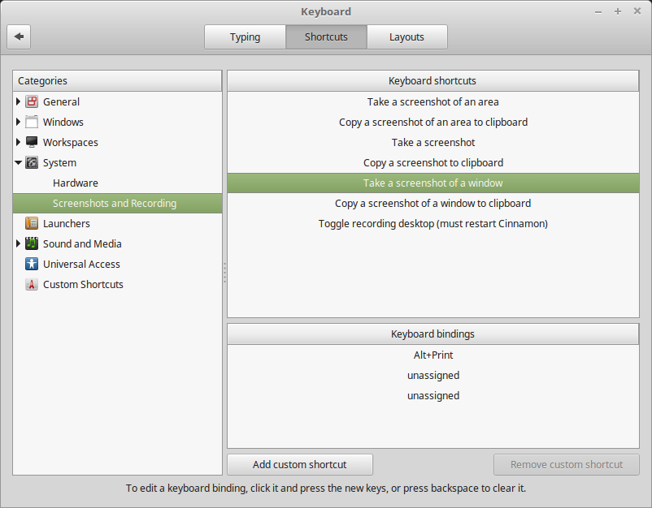

# Cinnamon

## Take a screenshot under Cinnamon

See [https://randomgeekery.org/2017/01/01/cinnamon-screenshot-shortcuts/](https://randomgeekery.org/2017/01/01/cinnamon-screenshot-shortcuts/).

`Menu` => `Preferences` => `Keyboard` => `Shortcuts` => `System` => `Screenshots and Recording`

## Create a new workplace

Hit `[Ctrl]+[Alt]+[Up arraw key]`.

Then you see a "+ tab" to the right of the screen.

