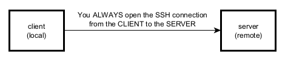
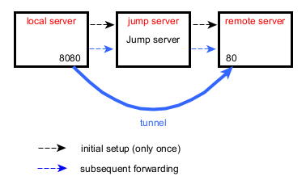
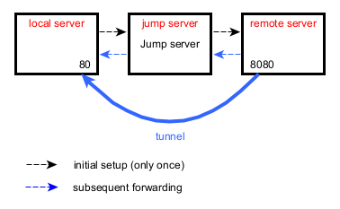

# SSH

## Tell the SSH client not to try all private keys

Use this option: `-o IdentitiesOnly=yes`.

```bash
ssh -o IdentitiesOnly=yes user@host
````

## Tell the SSH client to use only one identity file

Use this option: `-o IdentityFile=identity.key`.

```bash
ssh -o IdentitiesOnly=yes \
    -o IdentityFile=identity.key \
    user@host
```

> The identity file is the private key to use.

## Tell the SSH client not to check host key

Sometimes, SSH tells you:

    @@@@@@@@@@@@@@@@@@@@@@@@@@@@@@@@@@@@@@@@@@@@@@@@@@@@@@@@@@@
    @    WARNING: REMOTE HOST IDENTIFICATION HAS CHANGED!     @
    @@@@@@@@@@@@@@@@@@@@@@@@@@@@@@@@@@@@@@@@@@@@@@@@@@@@@@@@@@@
    IT IS POSSIBLE THAT SOMEONE IS DOING SOMETHING NASTY!
    Someone could be eavesdropping on you right now (man-in-the-middle attack)!
    ...

Sometimes you don't care about this event. This is the cas, for example, if you are in a testing environment.

To get rid of this message, use this option: `-oStrictHostKeyChecking=no`.

```bash
ssh -oStrictHostKeyChecking=no \
    -o IdentitiesOnly=yes \
    -o IdentityFile=identity.key \
    user@host
```

## authorized_keys or authorized_keys2 ?

**Answer**: use `authorized_keys`.

[What's the difference between "authorized_keys" and "authorized_keys2"?]
(https://serverfault.com/questions/116177/whats-the-difference-between-authorized-keys-and-authorized-keys2)

## How to copy a public key on a remote server ?

Use `ssh-copy-id`:

```bash
ssh-copy-id -o IdentitiesOnly=yes -i /path/to/public/key login@host
````

## SSH tunneling

### Definitions

| Term       | Definition                                                                                     |
|------------|------------------------------------------------------------------------------------------------|
| **Client** | means the machine where you start ssh. This machine is refered to by "**local**".              |
| **Server** | means the machine you want to connect to with ssh. This machine is refered to by "**remote**". |



### Local port forwarding

Local port forwarding is mostly used to connect to a remote service on an internal network such as a database or VNC server.

```
ssh -L 8080:<remote server>:80 <jump server>
```

> The SSH command is executed on the "local server."

All connections to port 8080 on the "local server" will be forwarded to port 80 on the "remote server."

> Please note that this command opens an interactive shell (where you can execute commands on the remote server).
> If you don't want an interactive shell to be open, you can use the option `-N`.
> 
> `-N`: _Do not execute a remote command. This is useful for just forwarding ports._
>
> Another interesting option is `-f`: _Requests ssh to go to background just before command execution._



### Remote port forwarding

Remote port forwarding is mostly used to give access to an internal service to someone from the outside.

```
ssh -R 8080:<remote server>:80 <jump server>
```

> The SSH command is executed on the "local server."

All connections to port 8080 on the "remote server" will be forwarded to port 80 on the "local server."



